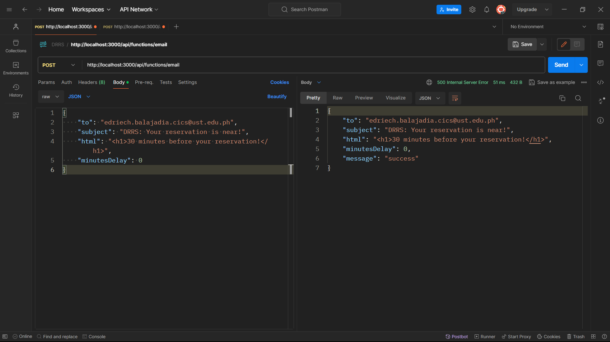

# drrs-be
Contains api for backend features. You can use the api by downloading **Postman**, then add the url endpoints and the JSON for input.

## TODO
- [x] Email reminder 30 minutes before reservation
- [x] Email reminder 10 minutes after reservation
- [x] Auto cancelation of reservations
- [x] Secure endpoints with JWT

## API
- **`GET`** `api\test` - test api

## Local installation
1. Set up `.env' file
2. `npm install`
3. `npm run dev`
4. Use **Postman** and then add the `URL` and `JSON` inputs.

